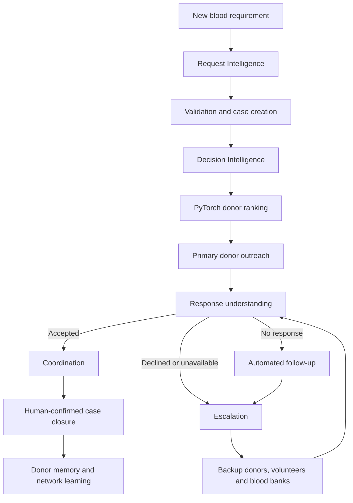
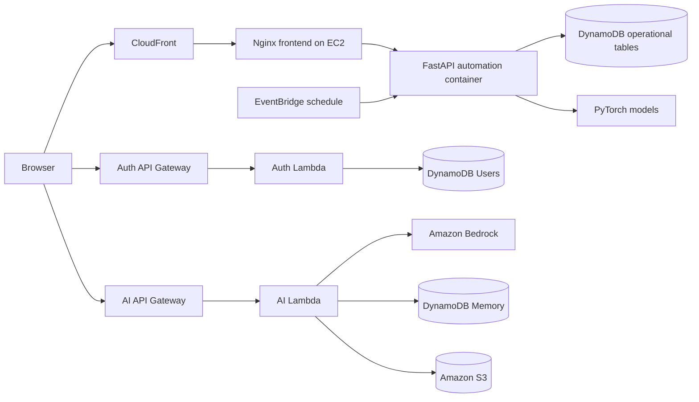

# CareCircle AI

CareCircle AI is an AWS-powered blood coordination platform that turns an
urgent blood requirement into a tracked, automated care workflow. It combines
deterministic medical compatibility rules, PyTorch donor intelligence,
conversational assistance through Amazon Bedrock, cloud authentication, and
event-driven case automation.

**Live application:**  
[https://d1gjn5058wkrpf.cloudfront.net](https://d1gjn5058wkrpf.cloudfront.net)

## Overview

Blood requests are often coordinated manually through calls, spreadsheets, and
messaging groups. That process makes it difficult to prioritize urgency,
identify eligible donors, follow up consistently, protect donor information,
and understand the current status of a case.

CareCircle AI provides one workflow for patients, donors, volunteers, and
administrators:

1. A patient submits or speaks a blood requirement.
2. The request is validated and stored as a cloud case.
3. Compatible and eligible donors are ranked.
4. Primary, backup, and emergency donor circles are created.
5. Outreach, follow-up, and escalation are tracked automatically.
6. Coordinators monitor the case until it is fulfilled or closed.
7. Donor interaction history improves future prioritization.

## Key Features

### Patient Experience

- Submit emergency and recurring blood requirements.
- Search using blood group, hospital, city, urgency, diagnosis, and deadline.
- Receive ranked donor matches without exposing private contact details.
- View PyTorch ranking scores and the reasons behind each match.
- Track requests through a controlled cloud case lifecycle.

### Donor Experience

- Register a donor profile and save it to the cloud.
- Calculate eligibility using the last donation date and donation cycle.
- Predict active donor status using a PyTorch classifier.
- Maintain response history, fatigue, opt-out status, and next eligibility.
- Access donor-specific profile and response pages.

### Hoon Buddy AI

- Accept typed or microphone-based requests.
- Use Amazon Bedrock with Amazon Nova Micro for conversational responses.
- Understand natural phrases such as `B positive`, `this week`, and
  `two units`.
- Ask focused follow-up questions when required information is missing.
- Read authenticated patient context and recent case information.
- Maintain compact conversation memory in DynamoDB.
- Propose structured actions while deterministic code validates and executes
  the workflow.
- Translate website content into English and six Indian languages.

### Automation and Coordination

- Create primary, backup, and emergency outreach groups.
- Run scheduled automation with bounded batch sizes.
- Follow up with non-responsive donors.
- Escalate unmatched cases to volunteers, blood banks, or Blood Warriors.
- Record approvals, outreach attempts, events, and escalation tasks.
- Move confirmed donors into coordination automatically.
- Preserve human control for sensitive outreach and final case closure.

### Administration

- View the complete operational dataset instead of static sample totals.
- Monitor cases, donor records, approvals, escalation tasks, and events.
- Export the donor registry as CSV.
- Plan, start, coordinate, fulfil, cancel, or reject controlled actions based
  on role permissions.

## Autonomous Workflow



The language model does not directly control donor selection or case state.
Bedrock handles conversation, extraction, and language generation. Blood
compatibility, validation, ranking inputs, permissions, state transitions,
follow-up limits, and escalation rules are implemented in deterministic
application code.

## Case State Machine

The automation service enforces valid transitions:

```text
DRAFT
  -> NEEDS_INFORMATION
  -> PLANNED
  -> AWAITING_APPROVAL
  -> OUTREACH_ACTIVE
  -> DONOR_CONFIRMED
  -> COORDINATING
  -> FULFILLED
```

Controlled terminal outcomes also include `CANCELLED`, `EXPIRED`, and
`UNFULFILLED`. Invalid transitions are rejected by the backend.

## Machine Learning

CareCircle includes two CPU-friendly PyTorch neural networks.

### Donor Active Status Classifier

Predicts whether a donor is likely to remain active using:

- Gender
- Donor type
- Previous donations
- Total outreach calls
- Donation cycle

Current recorded evaluation accuracy: **94.82%**

### Patient Cycle Regressor

Estimates the likely transfusion interval using patient condition, gender,
blood group, and required quantity.

Current recorded evaluation metrics:

- **MAE:** 5.97 days
- **MSE:** 51.26

Models are stored as PyTorch state dictionaries in `iii-project/assets/`.
Training code is available in
`iii-project/scripts/train_ml_models.py`, and inference is implemented in
`iii-project/automation/app/ml_service.py`.

ML predictions support prioritization; they do not replace clinical judgment,
blood-bank verification, or medical compatibility rules.

## Dataset

The bundled operational dataset contains:

- **7,033 total records**
- **4,439 donor records**
- **80 patient records**

The dataset powers the admin dashboard, donor ranking, model training, and
demonstration workflows. Build tooling is available in
`iii-project/scripts/build-carecircle-dataset.ps1`.

## Technology Stack

### Frontend

- HTML5
- CSS3
- Vanilla JavaScript
- Web Speech API and MediaRecorder
- OpenStreetMap integration
- Responsive mobile and desktop layouts

### Backend and Automation

- Python 3.12
- FastAPI
- Pydantic
- Uvicorn
- Node.js 18+
- AWS Lambda handlers
- Docker and Docker Compose
- Nginx reverse proxy

### Machine Learning

- PyTorch
- pandas
- NumPy
- scikit-learn

### AWS Services

- **Amazon CloudFront** for the public application URL and CDN delivery
- **Amazon EC2** for the Dockerized web and automation services
- **Amazon Bedrock** with Amazon Nova Micro for Hoon Buddy and translation
- **AWS Lambda** for authentication, AI requests, and serverless automation
- **Amazon API Gateway** for HTTPS APIs
- **Amazon DynamoDB** for users, cases, donors, memory, approvals, events,
  outreach attempts, and tasks
- **Amazon EventBridge** for scheduled automation
- **Amazon S3** for deployment artifacts and structured extraction results
- **Amazon Transcribe** when configured, with Vosk as the container fallback
- **AWS IAM** for service permissions
- **AWS Budgets** for cost monitoring

## Architecture



The Docker deployment contains two services:

- `carecircle-web`: Nginx frontend and reverse proxy
- `carecircle-automation`: FastAPI, workflow engine, voice transcription
  support, dataset access, and PyTorch inference

## Repository Structure

```text
.
|-- README.md
|-- iii-project/
|   |-- index.html, request.html, register.html, ...
|   |-- app.js
|   |-- style.css
|   |-- assets/
|   |   |-- carecircle-dataset.json
|   |   |-- donor_active_model.pt
|   |   `-- patient_cycle_model.pt
|   |-- automation/
|   |   |-- app/
|   |   |-- tests/
|   |   |-- Dockerfile
|   |   `-- template.yaml
|   |-- aws-ai-lambda/
|   |-- aws-auth-lambda/
|   |-- ec2-site/
|   |-- deploy/
|   |-- scripts/
|   |-- Dockerfile.frontend
|   `-- docker-compose.yml
|-- docs/
`-- pytest.ini
```

## Run Locally

### Prerequisites

- Node.js 18+
- Python 3.12+
- Docker Desktop, recommended for the complete stack
- AWS credentials only when testing AWS-connected services

### Frontend and Node API

```bash
cd iii-project
copy .env.example .env
npm start
```

The Node API starts on `http://127.0.0.1:8080` by default.

Check syntax:

```bash
npm run check
```

### Python Automation Service

```bash
cd iii-project/automation
python -m venv .venv
```

Windows:

```powershell
.\.venv\Scripts\Activate.ps1
pip install -r requirements.txt
pip install -r requirements-dev.txt
uvicorn app.main:app --reload --port 8000
```

macOS or Linux:

```bash
source .venv/bin/activate
pip install -r requirements.txt
pip install -r requirements-dev.txt
uvicorn app.main:app --reload --port 8000
```

Health endpoint:

```text
http://127.0.0.1:8000/automation/health
```

### Docker

Create `iii-project/.env.docker` with the required AWS and application
configuration, then run:

```bash
cd iii-project
docker compose up --build
```

The frontend is available at `http://localhost`, and Nginx proxies
`/automation/*` to the FastAPI container.

## Configuration

Do not place secrets in frontend JavaScript. Configure credentials and secrets
through AWS Lambda environment variables, EC2 environment files, IAM roles, or
your deployment platform's secret manager.

Important environment variables include:

```env
AWS_DEFAULT_REGION=ap-south-1
AUTH_SECRET=replace-with-a-long-random-secret
OUTREACH_MODE=simulation
BEDROCK_MODEL_ID=apac.amazon.nova-micro-v1:0
```

`OUTREACH_MODE=simulation` records workflow events without contacting real
people. Production outreach should only be enabled after configuring verified
messaging providers, consent handling, rate limits, and operational review.

## Testing

Run Python tests:

```bash
cd iii-project/automation
python -m pytest tests -q
```

Run JavaScript, AI, translation, and authentication tests:

```bash
cd iii-project
node --test hoon-action.test.js \
  aws-ai-lambda/translation.test.js \
  aws-ai-lambda/assistant.test.js \
  aws-auth-lambda/auth-logic.test.js
```

Latest verified result:

- **315 Python tests passed**
- **18 JavaScript AI/auth tests passed**

## Security and Privacy

- Passwords are salted and hashed with PBKDF2 before storage.
- Signed bearer tokens include role, identity, linked record, and expiry.
- Role checks protect administrative and coordination operations.
- Patients can only access their own protected cloud cases.
- Public administrator signup is disabled.
- Donor phone numbers remain masked for anonymous users.
- Provider credentials are not stored in browser code.
- Private keys, environment files, generated archives, and signed deployment
  URLs are excluded from Git.
- Deterministic validation runs before any model-proposed action is executed.

For a production healthcare deployment, add formal consent management,
encryption-key governance, audit retention policies, verified messaging,
regional privacy compliance, clinical review, and incident-response
procedures.

## Cost Awareness

The architecture uses on-demand and low-cost AWS services where practical:

- CPU-only PyTorch inference
- DynamoDB on-demand capacity
- Pay-per-request Bedrock and Lambda usage
- One Docker host for the frontend and automation service
- Scheduled automation with bounded case batches

Create AWS Budget alerts before deployment and avoid GPU instances,
provisioned Bedrock throughput, NAT Gateways, and oversized databases unless
they are genuinely required.

## Responsible Use

CareCircle AI is a coordination and decision-support project. It is not a
medical device and must not be used as the sole authority for transfusion
decisions. Blood groups, component compatibility, donor eligibility, units,
and hospital requirements must always be confirmed by qualified medical and
blood-bank professionals.

## Future Improvements

- Verified SMS, email, and WhatsApp outreach providers
- Hospital and blood-bank inventory integrations
- Geospatial travel-time ranking
- Model monitoring, drift detection, and retraining approval workflows
- Multilingual speech-to-text models for Indian languages
- Stronger observability with structured traces and operational dashboards
- Mobile applications for donors and field volunteers

## License

No open-source license has been selected yet. All rights are reserved unless a
license is added to this repository.

